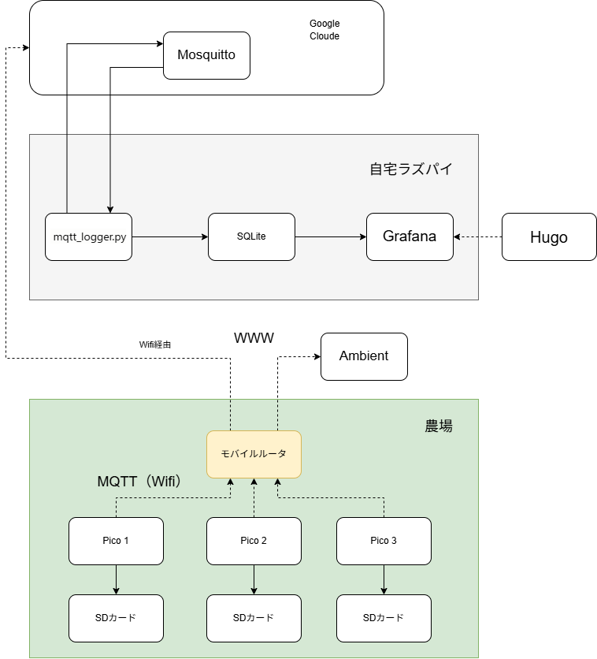
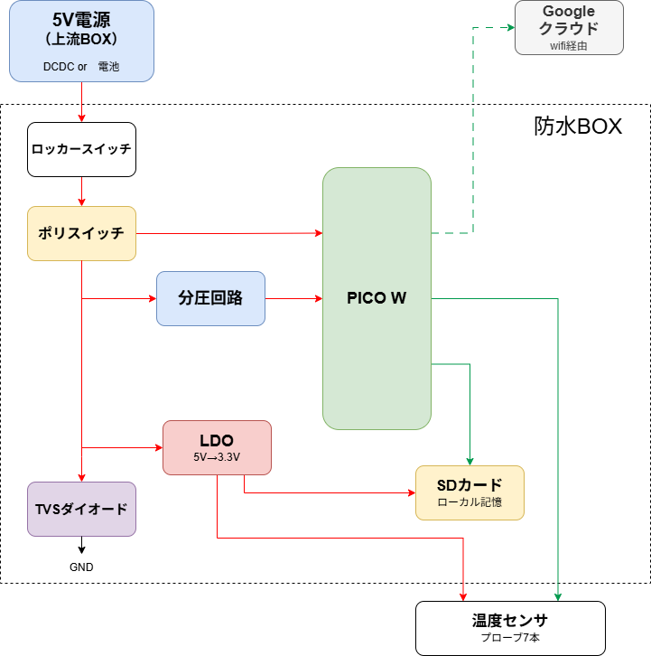

# 太陽熱養生 温度測定プロジェクト

太陽熱を利用した土壌養生（消毒）の効果を「感覚」ではなく「データ」で検証する。
畑の複数地点・複数深度に温度センサーを設置し、リアルタイムで計測・記録・可視化するIoTシステム。

---

## システム概要図



### データの流れ

1. **農場の PicoBox（3台）** が30分ごとに温度を計測
2. **カシムラ モバイルルータ**（SORACOM SIM）経由で WiFi → LTE でインターネットに出る
3. **Google Cloud（GCE）上の Mosquitto** が MQTT メッセージを受信
4. **GCE の mqtt_logger** が SQLite に保存 + **Flask API** で配信
5. **自宅の Raspberry Pi** も GCE の MQTT を購読し、ローカル SQLite に保存
6. **Grafana**（ラズパイ）と **ポートフォリオHP**（GitHub Pages）でグラフ表示

> データは GCE（API配信用）と自宅ラズパイ（Grafana用）の2箇所に保存される。

---

## ブラウザからの確認方法

自宅 LAN 内のPCから以下にアクセス：

| 画面 | URL | 内容 |
|---|---|---|
| Grafana ダッシュボード | http://192.168.0.10:3000 | Zone-A/B/C の温度グラフ（メインの確認画面） |
| ポートフォリオ HP | http://192.168.0.10:1313 | プロジェクト紹介ページ |
| ライブデータ（3分割） | http://192.168.0.10:1313/dashboard.html | Grafana の3パネルを iFrame で一覧表示 |

> Grafana は匿名アクセス有効（ログイン不要）。ポートフォリオ HP（Hugo）は手動起動が必要（後述）。

---

## ハードウェア構成

### PicoBox（3台共通）



| 部材 | 仕様 | 数量 |
|---|---|---|
| Raspberry Pi Pico W | RP2040 + CYW43439 | 3 |
| 温度センサー | DS18B20（防水型） | 21（7本 × 3台） |
| PCB（PicoBox） | JLCPCB 発注・自作基板 | 3 |
| SDカード | ローカルバックアップ用 | 3 |
| 防水BOX | 屋外設置用 | 3 |

### GPIO 割り当て（3台共通）

| 機能 | GPIO |
|---|---|
| DS18B20 × 7（S1〜S7） | GP8〜GP14 |
| SDカード（SPI） | GP2〜GP5、CD=GP6 |
| TX LED | GP15 |
| 主電源監視（ADC） | GP26 |

### センサー配置（1台あたり7本）

| ラベル | 位置 | 深さ |
|---|---|---|
| S1_center_10cm | 中央 | 10cm |
| S2_center_25cm | 中央 | 25cm |
| S3_center_40cm | 中央 | 40cm |
| S4_edge_10cm | エッジ | 10cm |
| S5_edge_25cm | エッジ | 25cm |
| S6_edge_40cm | エッジ | 40cm |
| S7_outdoor | 外気温 | — |

### ゾーン区分

| ゾーン | 区 | 処理内容 |
|---|---|---|
| zone-a | 区A | 標準区（たい肥＋菌＋ビニール） |
| zone-b | 区B | 対照・菌なし（たい肥＋ビニール） |
| zone-c | 区C | 対照・ビニールなし（たい肥のみ） |

### PicoBox ↔ ゾーン対応

| PicoBox筐体 | config.py ZONE | 設置エリア |
|---|---|---|
| ユニット3 | `zone-a` | 区A（標準区） |
| ユニット2 | `zone-b` | 区B（対照・菌なし） |
| ユニット1 | `zone-c` | 区C（対照・ビニールなし） |

> 筐体番号と区が一致しないが、config.py の ZONE で正しいゾーン名を送信するため
> DB上は常に物理エリアと一致する。

### 通信機器

| 機器 | 型番 | 役割 |
|---|---|---|
| モバイルルータ | カシムラ KD-249 | PicoBox の WiFi アクセスポイント → LTE 接続 |
| SIM | SORACOM Air plan-K2（KDDI） | モバイルデータ通信（月500MB、実使用量 約1.1MB/月） |

---

## サーバー構成（Raspberry Pi 4）

| コンポーネント | バージョン | 役割 | 自動起動 |
|---|---|---|---|
| mqtt_logger.py | Python 3.13 / paho-mqtt 2.1.0 | GCE の MQTT を購読 → SQLite に保存 | systemd ✅ |
| SQLite | 3.46.1 | データ保存（/var/lib/solar-heat/data.db） | — |
| Grafana | 13.0.1 + frser-sqlite-datasource | データ可視化（:3000） | systemd ✅ |
| Mosquitto | 2.0.21 | ローカル MQTT ブローカー（現在未使用） | systemd ✅ |
| Hugo | 0.131.0 + Blowfish v2.88.1 | ポートフォリオ HP（:1313） | **手動起動** |

### ラズパイの情報

| 項目 | 値 |
|---|---|
| OS | Debian 13 (trixie) aarch64 |
| ホスト名 | hp-server |
| IPアドレス | 192.168.0.10 |
| ストレージ | 28GB（24% 使用） |
| RAM | 3.7GB |

---

## クラウド構成（Google Cloud）

MQTT の中継サーバーとして GCE を使用。農場（モバイル回線）と自宅（固定回線）を繋ぐ。

| 項目 | 値 |
|---|---|
| プロジェクト | solar-heat-mqtt |
| VM名 | mqtt-broker |
| マシンタイプ | e2-micro（無料枠） |
| リージョン | us-central1-a |
| 外部IP | 34.58.138.105 |
| OS | Debian 12 (bookworm) |
| サービス | Mosquitto 2.0.11（:1883、認証あり）、mqtt_logger、Flask API（gunicorn :5000） |
| DB | /var/lib/solar-heat/data.db |
| API | https://34-58-138-105.sslip.io/api/（nginx + certbot SSL） |

---

## ソフトウェア構成

### ファイル一覧

```
solar-heat/
├── README.md                          # 本ファイル
├── pico/
│   ├── main.py                        # Pico W ファームウェア（MicroPython）
│   ├── config.py                      # WiFi/MQTT/ゾーン設定（.gitignore）
│   └── test_power_led.py              # LED テスト用
├── server/
│   ├── README.md                      # Pi セットアップ手順
│   ├── mqtt_logger.py                 # MQTT → SQLite 保存
│   ├── mqtt_logger.service            # systemd ユニットファイル
│   ├── mosquitto/
│   │   └── mosquitto.conf             # MQTT ブローカー設定
│   └── grafana/
│       └── provisioning/
│           ├── datasources/sqlite.yml
│           ├── dashboards/dashboards.yml
│           └── dashboards/solar-heat.json
├── docs/
│   ├── system_overview.png            # システム概要図
│   ├── picobox_diagram.png            # PicoBox 回路構成図
│   ├── server_design.md               # サーバー設計書（詳細）
│   ├── sensor_registry.md             # センサー台帳
│   ├── pcb_spec.md                    # PCB 設計仕様
│   ├── parts.md                       # 部品表
│   └── blog/                          # ブログ記事素材
└── kicad/                             # PCB 設計データ（KiCad）

GCE 上の配置（リポジトリ外、VM 内に直接配置）:
/home/nono/solar-heat/server/mqtt_logger.py  # MQTT ロガー（サービス実行元）
/var/lib/solar-heat/data.db                  # SQLite DB（API配信元）
/etc/systemd/system/mqtt_logger.service
```

### Pico ファームウェアの動作

`pico/main.py` は以下のサイクルを30分ごとに繰り返す：

1. DS18B20 × 7本から温度を読み取り
2. SDカードに CSV で記録（ローカルバックアップ）
3. WiFi ON → カシムラに接続
4. MQTT で GCE に温度データを送信（`solar-heat/{zone}/{label}`）
5. MQTT でデバイスステータスを送信（`solar-heat/{zone}/status`）
6. 電源電圧が 4.0V 未満なら電源アラートを送信
7. WiFi OFF → スリープ（ウォッチドッグタイマー feed しながら）

**ウォッチドッグタイマー**: 8秒タイムアウト。熱暴走等でフリーズした場合に自動リセットする。
起動直後に有効化され、メインループ内の各ステップおよびスリープ中（1秒ごと）に feed する。

### LED 表示パターン

| 状態 | 意味 |
|---|---|
| 消灯 | 正常 |
| 常時点灯 | 電源異常（bus_v < 4.0V） |
| 低速点滅 | SD異常 |
| 高速点滅 | 電源異常 + SD異常 |

### MQTT トピック

| トピック | ペイロード例 |
|---|---|
| `solar-heat/zone-a/S1_center_10cm` | `{"time": "2026-07-12T16:00:00", "temp": 29.88}` |
| `solar-heat/zone-a/status` | `{"zone": "zone-a", "bus_v": 5.02, "sd_status": "ok", "uptime_min": 120}` |
| `solar-heat/zone-a/power_alert` | `{"zone": "zone-a", "bus_v": 3.8, "alert": "main_power_lost"}` |

### SQLite テーブル

| テーブル | カラム | 内容 |
|---|---|---|
| temperature | timestamp, zone, label, temp | 温度データ |
| device_status | zone, bus_v, sd_status, wifi_attempts, uptime_min | デバイス状態 |
| power_alert | zone, bus_v, alert | 電源異常アラート |

---

## セットアップ手順

### 1. Raspberry Pi

詳細は `server/README.md` を参照。

```bash
# リポジトリ取得
cd ~ && git clone https://github.com/nono112002/solar-heat-soil-temp-trial.git solar-heat

# Mosquitto（ローカル、現在未使用だが残してある）
sudo ln -s ~/solar-heat/server/mosquitto/mosquitto.conf /etc/mosquitto/conf.d/solar-heat.conf
sudo systemctl restart mosquitto

# SQLite 保存先
sudo mkdir -p /var/lib/solar-heat && sudo chown nono:nono /var/lib/solar-heat

# mqtt_logger サービス
sudo ln -s ~/solar-heat/server/mqtt_logger.service /etc/systemd/system/mqtt_logger.service
sudo systemctl daemon-reload && sudo systemctl enable --now mqtt_logger

# Grafana（別途 apt で導入済み）
# プラグイン: grafana cli plugins install frser-sqlite-datasource
```

### 2. PicoBox（各台）

```bash
# ファームウェア書き込み（USB 接続状態で）
mpremote connect COMx fs cp pico/main.py :main.py
mpremote connect COMx fs cp pico/config.py :config.py
```

`config.py` は `.gitignore` で管理外。各台で ZONE と SENSOR_PINS を設定する。
リポジトリに `config_pico1.py` / `config_pico2.py` / `config_pico3.py` を用意してある。

```python
WIFI_SSID     = "field_wifi"
WIFI_PASSWORD = "nono-field"
MQTT_BROKER   = "34.58.138.105"
MQTT_PORT     = 1883
MQTT_USER     = "picobox"
MQTT_PASS     = "solar-heat-2026"
ZONE          = "zone-a"  # zone-a / zone-b / zone-c

# プローブ入替がある場合のみ記載（main.py のデフォルトを上書き）
SENSOR_PINS = {
    8:  "S3_center_40cm",   # GP8 のプローブが実際に40cmにある場合
    9:  "S2_center_25cm",
    10: "S1_center_10cm",
    ...
}
```

### 3. Hugo（ポートフォリオ HP）

```bash
# ラズパイで実行
cd ~ && git clone https://github.com/nono112002/nono112002.github.io.git portfolio
cd portfolio && git submodule update --init --recursive

# 起動（手動）
hugo server --bind 0.0.0.0 --baseURL http://192.168.0.10 -p 1313
```

### 4. Google Cloud（MQTT 中継 + バックアップ）

```bash
# gcloud CLI でセットアップ済み
# プロジェクト: solar-heat-mqtt
# VM: mqtt-broker (e2-micro, us-central1-a)
# Mosquitto 認証: picobox / solar-heat-2026
# ファイアウォール: tcp:1883 を開放

# バックアップロガー
# /opt/solar-heat/mqtt_logger.py — ローカル Mosquitto を購読し SQLite に保存
# /var/lib/solar-heat/data.db — ラズパイと同一スキーマのバックアップDB
# systemd: mqtt_logger.service（自動起動）
```

---

## 運用コマンド集

### ラズパイ（SSH: `ssh nono@192.168.0.10`）

```bash
# ログ確認
journalctl -u mqtt_logger -f

# MQTT 受信状況をリアルタイム確認
mosquitto_sub -h 34.58.138.105 -u picobox -P solar-heat-2026 -t 'solar-heat/#' -v

# DB 確認
sqlite3 /var/lib/solar-heat/data.db 'SELECT * FROM temperature ORDER BY id DESC LIMIT 10;'
sqlite3 /var/lib/solar-heat/data.db 'SELECT zone, COUNT(*) FROM temperature GROUP BY zone;'

# ソフト更新
cd ~/solar-heat && git pull && sudo systemctl restart mqtt_logger

# Hugo 起動
cd ~/portfolio && git pull --recurse-submodules
hugo server --bind 0.0.0.0 --baseURL http://192.168.0.10 -p 1313
```

### GCE（`gcloud compute ssh mqtt-broker --zone=us-central1-a`）

```bash
# Mosquitto ログ確認
sudo journalctl -u mosquitto -f

# 接続テスト
mosquitto_pub -h localhost -u picobox -P solar-heat-2026 -t test/hello -m "test"

# バックアップロガー確認
sudo journalctl -u mqtt_logger -f
sqlite3 /var/lib/solar-heat/data.db 'SELECT * FROM temperature ORDER BY id DESC LIMIT 10;'
```

---

## ブログ記事

| 回 | タイトル | URL |
|---|---|---|
| 第1回 | 太陽熱養生とは / 実験設計 | https://note.com/nono399/ |
| 第2回 | 回路設計・PCB発注 | https://note.com/nono399/ |
| 第3回 | ファームウェアと自宅サーバー | https://note.com/nono399/n/nedf561051aac |

---

## 詳細ドキュメント

| ドキュメント | 内容 |
|---|---|
| [サーバー設計書](docs/server_design.md) | ラズパイの詳細構成・配置・ハマりポイント |
| [センサー台帳](docs/sensor_registry.md) | 各 Pico のセンサー割り当て・DS18B20 ID |
| [PCB 設計仕様](docs/pcb_spec.md) | PicoBox 基板の設計仕様 |
| [部品表](docs/parts.md) | 購入部品一覧 |
